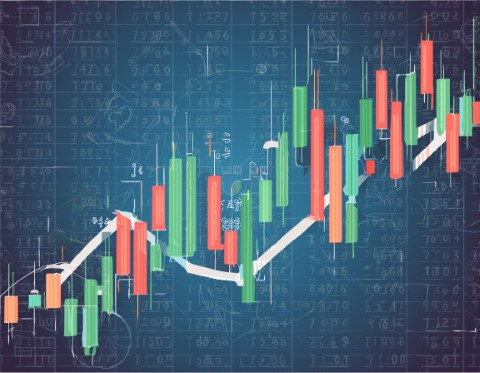
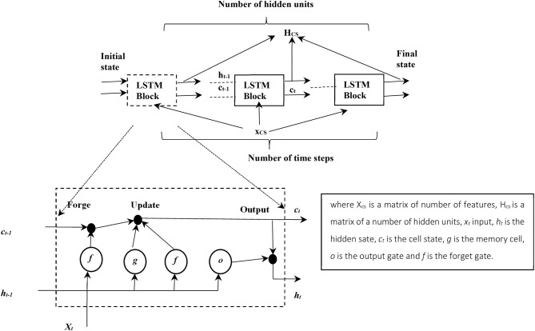

**LSTM** is particularly useful in analyzing stock market data because it can handle data with multiple input and output timesteps. 
For example, a company's stock price may be influenced by various factors such as economic indicators, market trends, and company-specific news.

In this notebook we use LSTM to predict the stock pricing of Microsoft shares using data extracted from Yahoo finances from 2000 to 2021, which was 
the year when we originally implemented this notebook.

**What is LSTM?**
Long Short-Term Memory (LSTM) is a type of recurrent neural network with a strong ability to learn and predict sequential data. 
The research shows that RNN is limited in maintaining long-term memory. Therefore, the LSTM was invented to overcome this limitation by adding memory 
structure, which can maintain its state over time, with gates to decide what to remember, what to forget and what to output. The LSTM shows effective
results in many applications that are inherently sequential such as speech recognition, speech synthesis, language modeling and translation and handwriting 
recognition. 
(From Selected approaches to supervised learning Khalid K. Al-jabery, ... Donald C. Wunsch II, in Computational Learning Approaches to Data Analytics in 
Biomedical Applications, 2020).

Long Short-Term Memory (LSTM) is indicated for problems related to large data sequences. 
They have the ability to identify short-term and long-term dependencies within temporal sequences. LSTM is composed of a set of recurrently connected subnets, 
called memory blocks,containing three multiplicative units, called forget gate, input gate, and output gate (Buduma & Locascio, 2017; Goodfellow et al., 2016).

_(image from: Artificial intelligence and internet of things to improve efficacy of diagnosis and remote sensing of solar photovoltaic systems: Challenges, 
recommendations and future directions Adel Mellit, Soteris Kalogirou, in Renewable and Sustainable Energy Reviews, 2021)_
